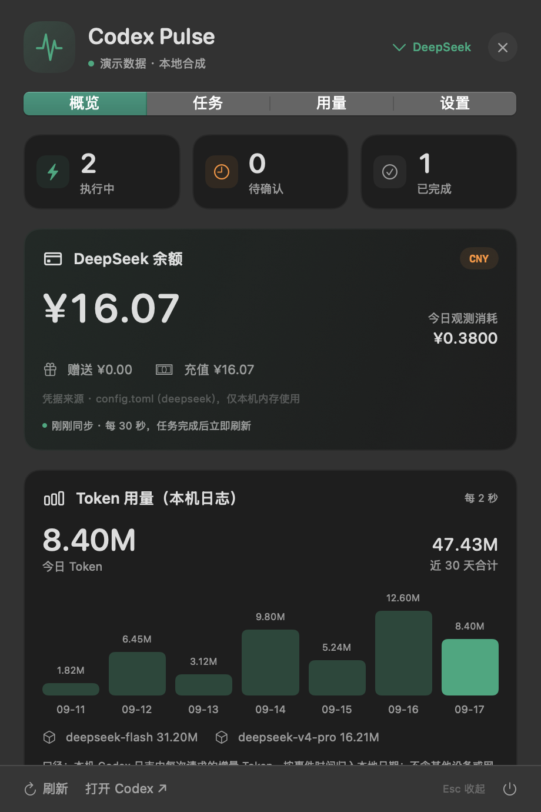
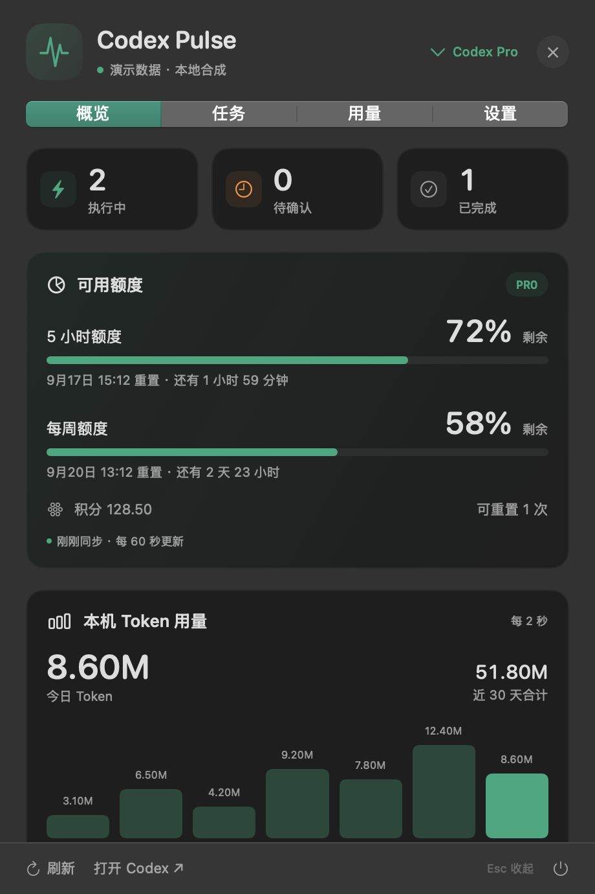
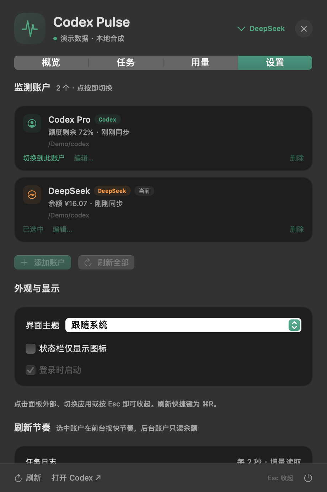

# Codex Pulse

一个原生 macOS 菜单栏小工具，随时查看 Codex / DeepSeek 账户的额度、余额与 Token 用量，以及本机任务执行情况。SwiftUI + AppKit，中文界面，支持系统浅色 / 深色外观，无第三方运行时依赖。



## 能看到什么

- **菜单栏**：活跃任务数 + 当前账户的主指标。Codex 账户显示额度剩余百分比（`2 · 72%`），DeepSeek 账户显示余额（`2 · ¥14.78`）。数据过期、断连或读取失败时显示 `—`。
- **多账户**：可同时登记多个账户，每个账户绑定一个 Codex 数据目录，面板右上角快速切换，设置页新增 / 编辑 / 删除。
- **DeepSeek 余额**：余额、赠送 / 充值拆分、账户是否可用、今日观测消耗（本机运行期间抓到的余额变化）。
- **Token 用量**：按本机 Codex 日志统计每次请求的增量 Token，按事件时间归入本地日期，并可查看输入 / 缓存命中 / 输出与按模型拆分。
- **额度**：按服务端实际返回的窗口展示剩余比例、重置时间、多模型额度、积分余额、可用重置次数。
- **任务**：本机最近 60 个未归档会话的标题、项目、模型、活动、执行状态、本轮 / 会话累计 Token、最近输入上下文占比。
- **账号使用**：累计 Token、连续使用天数、最近 7 个有记录日期的 Token 柱状图。
- **设置**：账户列表与编辑器、跟随系统 / 浅色 / 深色主题、状态栏仅图标、登录时启动、每个账户的数据目录与 CLI 路径。开机启动默认关闭。

## 0.3.0 多账户与 DeepSeek 适配

- 账户分两种类型：**Codex**（ChatGPT / Codex 登录，额度与账号用量来自 app-server）和 **DeepSeek**（余额来自官方余额接口，用量来自本机日志）。同一个数据目录可以按需要分别登记成两种类型。
- DeepSeek 账户不启动 app-server：把 `model_provider` 切到 DeepSeek 之后，Codex 的额度接口已经不可用（返回 `codex account authentication required`）。
- 余额每 30 秒刷新；本机任务一完成立即补一次刷新。Token 用量每 2 秒增量读取日志，不重复解析整个文件。
- 用量归属按每轮 `turn_context` 的模型名判定。切换提供商之后，同一份日志里会同时存在 DeepSeek 轮次和其他模型轮次，此时只有 DeepSeek 轮次计入 DeepSeek 账户。
- 切换账户会先丢弃上一个账户的快照，不会出现 A 账户数字留在 B 账户名字下面的情况。后台账户只按 10 分钟读取 DeepSeek 余额，Codex 账户保留上次快照直到切换过去。

Codex 账户保留原有额度卡，并新增本机 Token 用量卡：



设置页管理账户、切换与查看每个账户的实时摘要：



## 0.2.1 目录打开修复

- 任务按钮统一为“在 Finder 中打开”，详情显示实际目录。
- 旧目录移动或删除后明确提示，可选择并记住新位置；右键任务可“更改项目目录…”。同一旧路径的任务共用映射，仅保存在本机，不修改 Codex 历史记录。
- 明确指定 Finder，异步打开；失败和 10 秒未返回结果均显示提示，避免一直无反馈。超时不代表系统请求已取消，它仍可能稍后完成。

## 0.2.0 交互与界面

- 点击面板外部、切换应用或按 Esc 自动收起；右上角也有收起按钮。没有固定展开模式。
- 四个页面：概览、任务、用量、设置。任务搜索支持名称、项目路径、模型和会话 ID；多个关键词同时匹配。
- 支持全部 / 执行中 / 待确认 / 已完成 / 已中断 / 未知筛选，按任务状态、最近更新或累计 Token 排序。
- 点击任务展开详情，查看本轮 Token、上下文占比；可在 Finder 中打开目录或复制会话 ID。
- 额度显示重置倒计时、同步新鲜度和更新中状态；⌘R 立即刷新。
- 登录项与账号配置沿用已有设置。旧刘海面板及其开关已移除。

## 运行

需要 macOS 14+、Swift 5.9+ 编译器（测试需要 Swift 6+）以及已登录的 Codex CLI。当前已在 Apple Silicon、Codex CLI 0.154.0 上验证。Codex 的 App Server 与本地日志格式会变化；遇到不兼容数据会显示不可用。

```bash
git clone git@github.com:Yuwangzhi/codex-pulse.git
cd codex-pulse
./scripts/build.sh --install
```

脚本构建 `dist/Codex Pulse.app`，复制到 `~/Applications/Codex Pulse.app` 并启动。应用仅在状态栏显示，不占 Dock。更新安装前请先退出旧版本。

仅构建：`./scripts/build.sh`。退出：面板右下角电源按钮。卸载：退出后移除该 App；如果启用了登录时启动，先在设置中关闭。

本地构建使用 ad-hoc 签名，未经过 Apple 公证。分发到另一台 Mac 建议在目标机器上从源码构建。

## 数据来源与口径

| 内容 | 来源 | 刷新 |
| --- | --- | --- |
| Codex 账号额度 | `codex app-server` → `account/rateLimits/read` | 每 60 秒及额度通知后 |
| Codex 账号 Token | `account/usage/read` | 每 5 分钟 |
| DeepSeek 余额 | `GET {base_url}/user/balance` | 每 30 秒、任务完成后及 ⌘R |
| DeepSeek Token 用量 | 本机 rollout JSONL 的 `token_count` 增量 | 每 2 秒 |
| 会话列表 | `CODEX_HOME/state_*.sqlite`，只读连接 | 每 2 秒 |
| 任务活动 | 对应 rollout JSONL，增量读取完整行 | 每 2 秒 |

使用 [OpenAI 官方 App Server 文档](https://learn.chatgpt.com/docs/app-server) 中的账号查询接口。Pulse 启动独立的查询进程，复用 Codex 自己的登录流程；不调用模型任务接口，不自动消费额度重置次数。退出后关闭自己的查询进程。

**任务状态是本机日志观测，不是桌面应用的全局运行状态 API。** 最近 120 秒内的未结束活动显示“执行中”；超过 120 秒没有新事件显示“待确认”，工具可能仍在执行；只有 `task_complete` / `turn_aborted` 才显示完成 / 中断。某些审批等待没有可用日志事件，因此不猜测“等待审批”。云端和其他设备的任务不在本机任务列表内，账号统计则采用服务端返回的账号范围。

首次最多读取每个日志的末尾 4 MiB，此后只读取新增字节。历史上下文被截断时，无法恢复的字段保持未知。只读最近 60 个未归档会话；早于此范围的长任务可能不显示。会话 Token 使用累计值覆盖，避免把每次上报的累计数重复相加。本轮 Token 取 `turn_token_usage`，旧格式没有该字段则显示 `—`。上下文占比取最近请求的输入 Token / 上下文窗口，是近似指标。

额度窗口使用服务端实际时长，**不假设一定有“5 小时 + 每周”两种额度**。过了重置时间不会自行恢复为 100%，需要下一次服务端快照。积分是服务端的 credits 单位，不代表美元或剩余 Token。未返回的余额、百分比和计数均显示未知；不把缺失值当成 0。账号每日统计保留服务端日期，不承诺自然日时区，也不将最后一个日期冒充“今日”。

**Token 用量口径。** 计的是每次请求的增量（`event_msg` → `token_count` → `last_token_usage`），不是本轮累计值，也不是 `threads.tokens_used`：压缩会重置累计计数，实测一份 1.33 GB 日志里 `tokens_used` 只有逐次增量求和的五分之一。只统计**这台机器**记录的请求，网页端、其他设备和其他数据目录的调用不在其中；日期按运行本机时区归集。超过 256 MiB 的日志首次只读取尾部，界面会提示有多少份日志被截断、更早轮次可能未计入。

**DeepSeek 的口径。** 官方接口只提供余额，没有用量查询（`/user/usage` 等路径返回 404），所以余额是服务端真值，用量是本机观测值，两者口径不同、不能互相推导。余额按账户的 `balance_infos` 展示，优先取 CNY；「今日观测消耗」来自 Pulse 运行期间抓到的当日首末余额差，未运行的时间段不回算，当天只有一次采样时不显示。

## 隐私

Pulse 不读取也从不保存 `auth.json`、账号邮件或会话正文，不上传本机任务信息。CLI 自行处理 Codex 登录与额度网络查询。

DeepSeek 余额请求需要凭据，处理方式是：优先使用你在设置里填写、保存在 **macOS 钥匙串**里的 API Key；没有时按该账户自己的 `config.toml` 读取 `model_providers.<name>` 的 `experimental_bearer_token`，或按其中的 `env_key` 读取环境变量。凭据只在发起请求时于内存中使用，**不写入磁盘、不写日志、不进入界面，也不出现在 `--diagnose` / `--usage-check` 输出里**；设置页只显示来源（钥匙串 / config.toml / 环境变量），不显示内容，并可一键清除钥匙串中的 Key。

日志解析会在内存中解码事件，仅投影任务状态、工具名和用量；原始记录不落盘。会话标题只在本机 UI 展示。仓库不包含真实会话、余额快照或凭据，截图使用明确标记的虚构演示数据。

设置保存在 macOS UserDefaults。不写入 Codex 配置或会话库；Codex 查询进程自身仍可能按其正常行为维护运行时元数据。

## 开发与验证

```bash
./scripts/swift-tool.sh build
./scripts/swift-tool.sh test
./scripts/build.sh
"dist/Codex Pulse.app/Contents/MacOS/CodexPulse" --diagnose
"dist/Codex Pulse.app/Contents/MacOS/CodexPulse" --usage-check
"dist/Codex Pulse.app/Contents/MacOS/CodexPulse" --demo --show --ui-check
"dist/Codex Pulse.app/Contents/MacOS/CodexPulse" --demo --dark --screenshot /tmp/pulse-dark.png
"dist/Codex Pulse.app/Contents/MacOS/CodexPulse" --demo --kind codex --dark --screenshot /tmp/pulse-codex.png
"dist/Codex Pulse.app/Contents/MacOS/CodexPulse" --demo --dark --screenshot /tmp/pulse-usage.png --tab 2
```

`--diagnose` 运行 20 秒后退出，`--usage-check` 运行 12 秒。两者按账户输出连接状态、额度 / 余额是否可用、用量账本读取的日志份数、日期与 Token 合计（`--usage-check` 另给最近日期明细与凭据来源），不输出凭据本身、标题、账号 ID、积分或日志正文。演示模式不连接 CLI、不联网、不读取本机会话；`--demo --kind codex` 选择演示里的 Codex 账户，默认是 DeepSeek 账户。`scripts/swift-tool.sh` 为部分 Command Line Tools 版本补全其自带 SwiftPM 框架搜索路径，所有设置仅影响当前构建进程。

`--show` 打开实际状态栏弹窗；`--ui-check` 只在标准输出记录弹窗显示 / 关闭，供原生交互验证。`--tab 0/1/2/3` 可选择截图页面。

测试覆盖：任务跨字段搜索、状态筛选、不同排序与稳定顺序；任务生命周期、长时间无事件、跨轮次结束事件、累计 Token 去重、缺失额度、不同时长窗口、过期重置时间、分段写入、日志截断 / 替换及有界尾部读取；`config.toml` provider 扫描与凭据优先级、DeepSeek 余额解码与端点拼接、余额历史与观测消耗、账户注册表迁移、用量账本的按日 / 按模型归集、增量与半行追加、尾部截断边界、累计回退、窗口过滤、账户类型过滤、混合会话语义。

## 目录

```text
Sources/CodexPulse/       菜单栏、SwiftUI 面板、账户运行时、Codex RPC、DeepSeek 余额客户端
Sources/CodexPulseCore/   数据模型、账户与 provider 配置、只读数据库、增量日志解析、用量账本
Tests/                   合成数据测试，不依赖真实 Codex 账号
Resources/               App 元数据
scripts/                 构建、安装、图标生成
```
